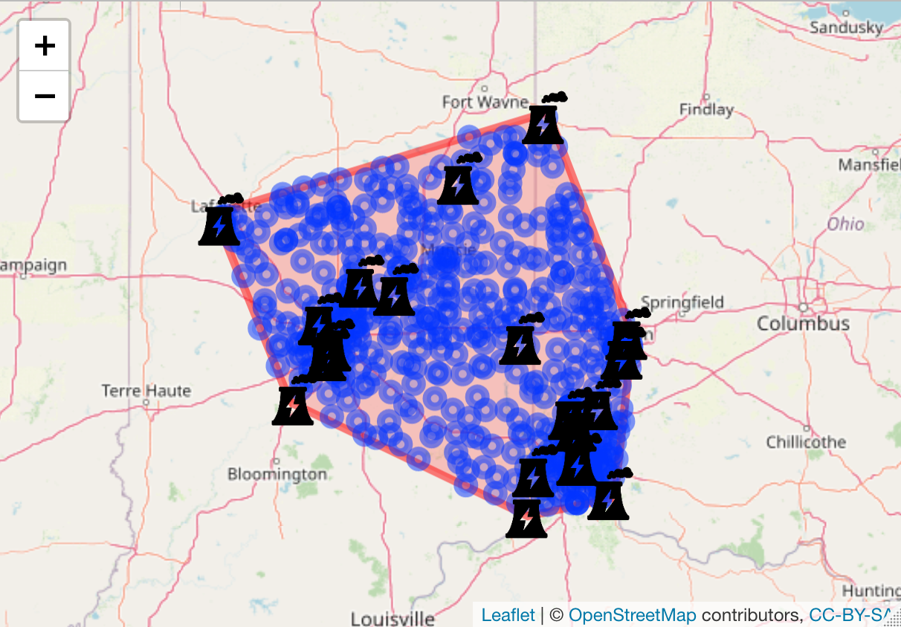
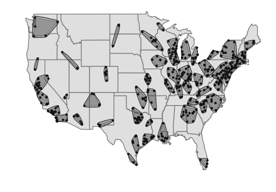

# Bipartite Interference

Code for the manuscript:

Zigler, Corwin M., and Georgia Papadogeorgou. "Bipartite causal inference with interference." _Statistical science_ 36.1 (2021): 109.
APA	

The code here is to illustrate how the IPW estimator can be used for bipartite data. The code replicates part of the analysis. The power plant data are available, but since the outcome data correspond to Medicare data which we cannot make pubic, we simply generate a fake outcome which we analyze.

The analysis requires the R package ```Interference``` available at: https://github.com/gpapadog/Interference

## Summary of files and their functionality

*Data/*

It includes power plant data and zip code data. The power plant data include the treatment indicator, information on the power plant such as its size and operation characteristics, and information on the population residing in the area near the power plant. The zip code data include zip code coordinate information, the cluster they belong to, and the index of the closest power plant.

*functions/*

Functions for linking power plants to zip codes, and for plotting clusters

*R code*

- ```link_conv_hull.R```: It creates a visualization of one of the clusters. It shows the zip code centroids as cirlces, and uses an icon for the power plants. The result should look like this:



- ```plot_of_clusters.R```: It shows the map of the US with the clusters and corresponding buffer zones:
 

- ```Data_analysis.R```: Analyzing the power plant data with a randomly generated outcome. It requires the ```arepa``` R package (https://github.com/czigler/arepa) for spatial linkage of power plants and zip codes. 


